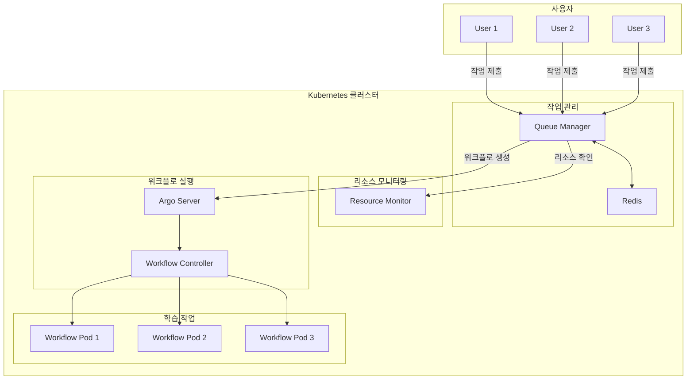

# k8s Multi-Container System Architecture

## 시스템 개요

## 주요 컴포넌트

### Queue Manager
- Redis 기반 작업 대기열 관리
- GPU 리소스 가용성 확인 후 순차 실행
- REST API로 작업 제출 받음

### Resource Monitor  
- 실시간 GPU/CPU/메모리 사용률 모니터링
- HTTP API로 리소스 상태 제공

### Argo Workflow
- Kubernetes 워크플로 오케스트레이션
- Proto-GCN 학습 작업 실행
- 웹 UI 제공

## 데이터 흐름

1. 사용자가 Queue Manager API로 작업 제출
2. Redis 대기열에 작업 저장
3. 스케줄러가 GPU 리소스 확인
4. 리소스 가용 시 Argo 워크플로 생성
5. Proto-GCN 파드에서 실제 학습 실행

## 리소스 관리

- **GPU**: 1개 GPU, 순차 처리 (동시 실행 1개)
- **메모리**: 파드당 16Gi 제한
- **스토리지**: 로컬 데이터 마운트
- **네트워크**: Flannel CNI (10.244.0.0/16)

## 확장성

- 현재: 1 GPU 노드, 순차 처리
- 확장: 다중 GPU 노드 추가 시 병렬 처리 가능
- 대기열: Redis 기반 무제한 작업 대기
