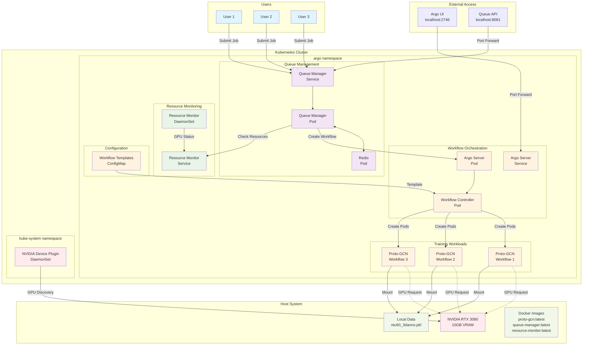
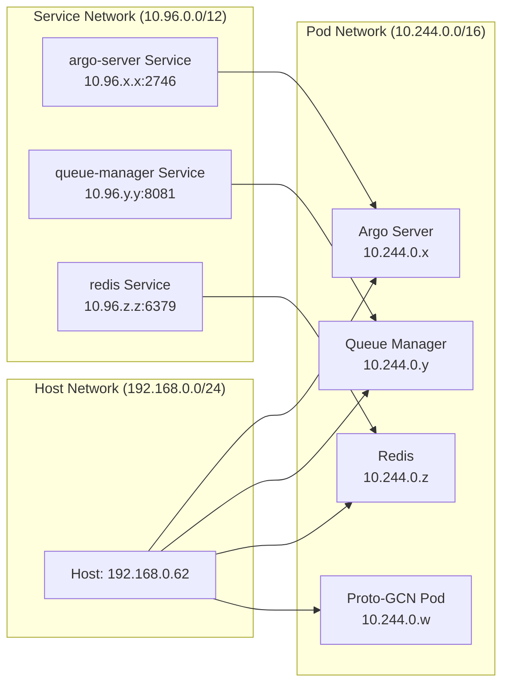
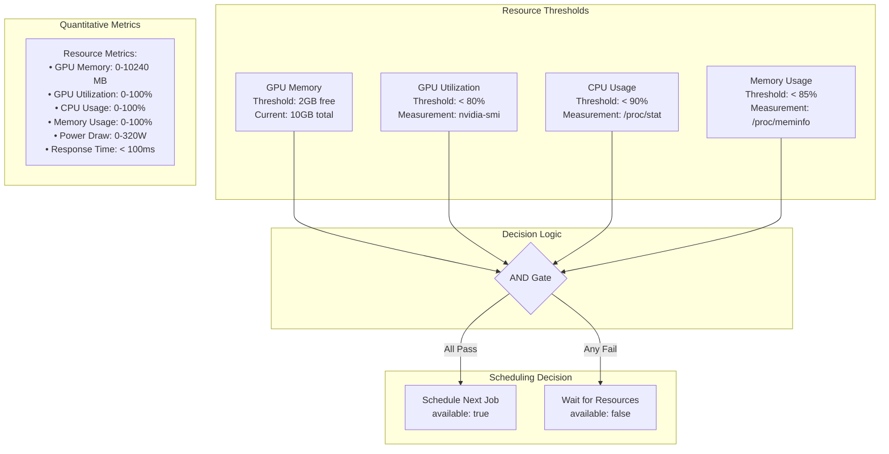
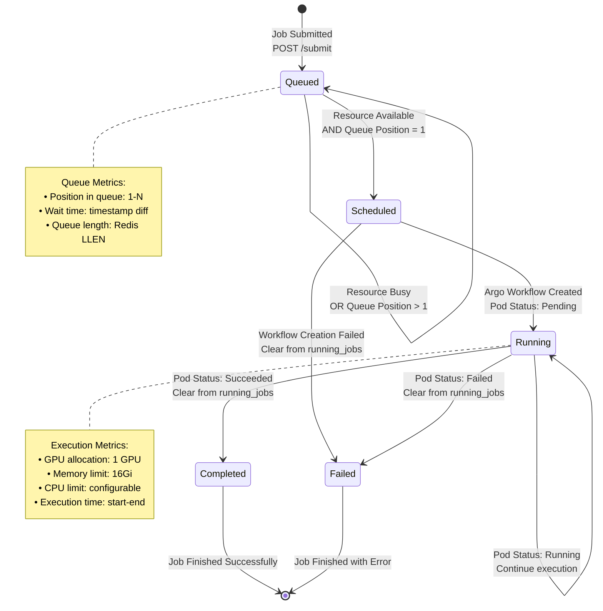
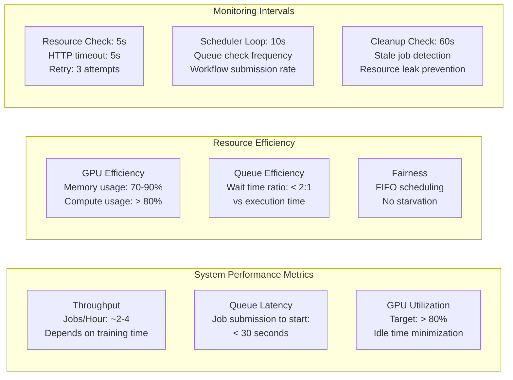

# Kubernetes Multi-User GPU Training System Architecture

## System Overview



## Component Details

### Queue Management Layer
- **Queue Manager**: Redis 기반 작업 대기열 관리 및 스케줄링
- **Redis**: 작업 상태 및 대기열 데이터 저장
- **Scheduling Logic**: GPU 리소스 가용성 확인 후 순차 실행

### Resource Monitoring Layer  
- **Resource Monitor**: 실시간 GPU/메모리 사용률 모니터링
- **DaemonSet**: 모든 노드에서 리소스 상태 수집
- **HTTP API**: 큐 매니저가 리소스 상태 조회

### Workflow Orchestration Layer
- **Argo Server**: 워크플로 관리 및 UI 제공
- **Workflow Controller**: 실제 파드 생성 및 라이프사이클 관리
- **ConfigMap**: Proto-GCN 워크플로 템플릿 저장

### GPU Resource Management
- **NVIDIA Device Plugin**: GPU 리소스 검색 및 할당
- **Resource Limits**: 워크플로별 GPU 1개 할당
- **Sequential Execution**: 동시 실행 1개, 나머지 대기열

## Data Flow

1. **Job Submission**: 사용자 → Queue Manager API
2. **Queue Processing**: Redis 대기열 → 스케줄러 확인
3. **Resource Check**: Queue Manager → Resource Monitor
4. **Workflow Creation**: Queue Manager → Argo Server
5. **Pod Execution**: Workflow Controller → Proto-GCN Pod
6. **GPU Allocation**: NVIDIA Device Plugin → GPU 할당
7. **Training Execution**: Proto-GCN → 실제 모델 학습

## Scalability

- **Current**: 1 GPU, 순차 처리
- **Horizontal Scaling**: 다중 GPU 노드 추가 시 병렬 처리 가능
- **Queue Capacity**: Redis 기반으로 무제한 작업 대기 가능
- **User Isolation**: 각 워크플로는 독립적인 파드에서 실행
## Infrastructure Architecture with Kubernetes

```mermaid
graph TB
    subgraph "Physical Infrastructure"
        subgraph "Host Machine"
            OS[Ubuntu 24.04 LTS]
            DOCKER_ENGINE[Docker Engine]
            CONTAINERD[containerd Runtime]
            GPU_HW[NVIDIA RTX 3080<br/>10GB VRAM]
            NVIDIA_DRIVER[NVIDIA Driver 580.95]
            STORAGE[Local Storage<br/>Proto-GCN Data]
        end
    end
    
    subgraph "Kubernetes Control Plane"
        subgraph "Master Components"
            API_SERVER[kube-apiserver]
            ETCD[etcd]
            SCHEDULER[kube-scheduler]
            CONTROLLER[kube-controller-manager]
        end
    end
    
    subgraph "Kubernetes Node"
        subgraph "Node Components"
            KUBELET[kubelet]
            KUBE_PROXY[kube-proxy]
            CNI[Flannel CNI<br/>10.244.0.0/16]
        end
        
        subgraph "Container Runtime"
            CONTAINERD_NODE[containerd]
            RUNC[runc]
        end
    end
    
    subgraph "Kubernetes Workloads"
        subgraph "kube-system namespace"
            COREDNS[CoreDNS]
            FLANNEL[Flannel DaemonSet]
            NVIDIA_PLUGIN[NVIDIA Device Plugin<br/>DaemonSet]
        end
        
        subgraph "argo namespace"
            subgraph "Application Pods"
                ARGO_SERVER[Argo Server Pod]
                WORKFLOW_CTRL[Workflow Controller Pod]
                QUEUE_MGR[Queue Manager Pod]
                REDIS_POD[Redis Pod]
                RESOURCE_MON[Resource Monitor<br/>DaemonSet]
            end
            
            subgraph "Training Workloads"
                PROTO_POD1[Proto-GCN Pod 1<br/>GPU: 1]
                PROTO_POD2[Proto-GCN Pod 2<br/>Pending]
                PROTO_POD3[Proto-GCN Pod 3<br/>Pending]
            end
            
            subgraph "Kubernetes Resources"
                SERVICES[Services<br/>argo-server<br/>queue-manager<br/>resource-monitor]
                CONFIGMAPS[ConfigMaps<br/>workflow-templates]
                RBAC[RBAC<br/>ClusterRole<br/>ClusterRoleBinding]
            end
        end
    end
    
    subgraph "External Access"
        KUBECTL[kubectl CLI]
        ARGO_UI[Argo UI<br/>Port Forward 2746]
        QUEUE_API[Queue API<br/>Port Forward 8081]
    end
    
    subgraph "Container Images"
        REGISTRY[Local Docker Images]
        PROTO_IMG[proto-gcn:latest<br/>CUDA 11.3 + PyTorch]
        QUEUE_IMG[queue-manager:latest<br/>Python + Redis Client]
        MONITOR_IMG[resource-monitor:latest<br/>CUDA Runtime]
    end
    
    %% Infrastructure Connections
    OS --> DOCKER_ENGINE
    OS --> CONTAINERD
    OS --> GPU_HW
    OS --> NVIDIA_DRIVER
    DOCKER_ENGINE --> REGISTRY
    
    %% Kubernetes Control Plane
    API_SERVER <--> ETCD
    API_SERVER <--> SCHEDULER
    API_SERVER <--> CONTROLLER
    
    %% Node Components
    KUBELET <--> API_SERVER
    KUBELET --> CONTAINERD_NODE
    CONTAINERD_NODE --> RUNC
    KUBE_PROXY --> CNI
    
    %% System Pods
    KUBELET --> COREDNS
    KUBELET --> FLANNEL
    KUBELET --> NVIDIA_PLUGIN
    
    %% Application Pods
    KUBELET --> ARGO_SERVER
    KUBELET --> WORKFLOW_CTRL
    KUBELET --> QUEUE_MGR
    KUBELET --> REDIS_POD
    KUBELET --> RESOURCE_MON
    KUBELET --> PROTO_POD1
    
    %% GPU Resource Flow
    NVIDIA_DRIVER --> NVIDIA_PLUGIN
    NVIDIA_PLUGIN --> PROTO_POD1
    GPU_HW -.->|Exclusive Access| PROTO_POD1
    
    %% Container Images
    REGISTRY --> PROTO_IMG
    REGISTRY --> QUEUE_IMG
    REGISTRY --> MONITOR_IMG
    PROTO_IMG --> PROTO_POD1
    QUEUE_IMG --> QUEUE_MGR
    MONITOR_IMG --> RESOURCE_MON
    
    %% External Access
    KUBECTL <--> API_SERVER
    ARGO_UI <--> ARGO_SERVER
    QUEUE_API <--> QUEUE_MGR
    
    %% Data Access
    STORAGE --> PROTO_POD1
    
    %% Networking
    CNI --> SERVICES
    SERVICES --> ARGO_SERVER
    SERVICES --> QUEUE_MGR
    SERVICES --> RESOURCE_MON
    
    %% Styling
    classDef infraClass fill:#e3f2fd
    classDef k8sClass fill:#f3e5f5
    classDef appClass fill:#e8f5e8
    classDef gpuClass fill:#ffebee
    classDef networkClass fill:#fff3e0
    
    class OS,DOCKER_ENGINE,CONTAINERD,GPU_HW,NVIDIA_DRIVER,STORAGE infraClass
    class API_SERVER,ETCD,SCHEDULER,CONTROLLER,KUBELET,KUBE_PROXY,CNI k8sClass
    class ARGO_SERVER,WORKFLOW_CTRL,QUEUE_MGR,REDIS_POD,RESOURCE_MON appClass
    class NVIDIA_PLUGIN,PROTO_POD1,PROTO_POD2,PROTO_POD3 gpuClass
    class SERVICES,CONFIGMAPS,RBAC networkClass
```



## Kubernetes Infrastructure Details

### Physical Layer
- **Host OS**: Ubuntu 24.04 LTS
- **Container Runtime**: containerd 2.2.0
- **GPU**: NVIDIA RTX 3080 with Driver 580.95
- **Storage**: Local filesystem for training data

### Kubernetes Cluster
- **Distribution**: kubeadm initialized cluster
- **CNI**: Flannel with pod CIDR 10.244.0.0/16
- **Single Node**: Control plane + worker on same machine
- **GPU Support**: NVIDIA Device Plugin for GPU resource management

### Network Architecture


### Resource Management
- **GPU Allocation**: `nvidia.com/gpu: 1` per training pod
- **Memory Limits**: 16Gi per training pod
- **CPU Limits**: Configurable per workload
- **Storage**: HostPath volumes for data access

### Security & RBAC
- **Service Accounts**: argo-server with cluster permissions
- **RBAC**: ClusterRole for workflow and GPU resource access
- **Network Policies**: Default allow (single-node cluster)

### Monitoring & Observability
- **Resource Monitor**: DaemonSet on all nodes
- **Argo UI**: Web interface for workflow monitoring
- **kubectl**: CLI access for cluster management
- **GPU Monitoring**: nvidia-smi integration
## Resource Management & Scheduling Algorithms

### Resource Monitoring Algorithm

```mermaid
flowchart TD
    START([Resource Monitor Start]) --> INIT[Initialize nvidia-smi & /proc monitoring]
    INIT --> COLLECT[Collect Metrics Every 5s]
    
    COLLECT --> GPU_CHECK{GPU Available?}
    GPU_CHECK -->|Yes| GET_GPU[nvidia-smi --query-gpu=<br/>memory.used,memory.total,<br/>utilization.gpu,power.draw]
    GPU_CHECK -->|No| GPU_ERROR[GPU Metrics: N/A]
    
    GET_GPU --> PARSE_GPU[Parse GPU Metrics:<br/>• Memory: used/total MB<br/>• Utilization: 0-100%<br/>• Power: Watts]
    
    PARSE_GPU --> GET_CPU[Read /proc/stat<br/>Calculate CPU Usage %]
    GET_CPU --> GET_MEM[Read /proc/meminfo<br/>Calculate Memory Usage %]
    
    GET_MEM --> CALC_AVAIL{Calculate Availability}
    GPU_ERROR --> CALC_AVAIL
    
    CALC_AVAIL --> AVAIL_LOGIC[Availability Logic:<br/>available = (<br/>  gpu_memory_free > 2GB AND<br/>  gpu_utilization < 80% AND<br/>  cpu_usage < 90% AND<br/>  memory_usage < 85%<br/>)]
    
    AVAIL_LOGIC --> FORMAT[Format JSON Response:<br/>{<br/>  "gpu_utilization": int,<br/>  "gpu_memory_used": int,<br/>  "gpu_memory_total": int,<br/>  "cpu_usage": float,<br/>  "memory_usage": float,<br/>  "available": boolean<br/>}]
    
    FORMAT --> SERVE[Serve HTTP on :8080/status]
    SERVE --> COLLECT
    
    classDef processClass fill:#e3f2fd
    classDef decisionClass fill:#fff3e0
    classDef dataClass fill:#e8f5e8
    
    class COLLECT,GET_GPU,PARSE_GPU,GET_CPU,GET_MEM processClass
    class GPU_CHECK,CALC_AVAIL decisionClass
    class FORMAT,SERVE dataClass
```

### Job Scheduling Algorithm

```mermaid
flowchart TD
    SCHED_START([Scheduler Loop Start]) --> QUEUE_CHECK[Check Redis Queue Length]
    QUEUE_CHECK --> EMPTY{Queue Empty?}
    EMPTY -->|Yes| WAIT[Sleep 10s]
    WAIT --> QUEUE_CHECK
    
    EMPTY -->|No| RUNNING_CHECK[Check Redis running_jobs count]
    RUNNING_CHECK --> RUNNING{Running Jobs > 0?}
    RUNNING -->|Yes| WAIT
    
    RUNNING -->|No| RESOURCE_REQ[Request Resource Status<br/>GET /resource-monitor:8080/status]
    RESOURCE_REQ --> PARSE_RESP[Parse Response:<br/>available: boolean]
    
    PARSE_RESP --> AVAILABLE{available == true?}
    AVAILABLE -->|No| WAIT
    
    AVAILABLE -->|Yes| DEQUEUE[Redis RPOP job_queue]
    DEQUEUE --> JOB_EXISTS{Job Retrieved?}
    JOB_EXISTS -->|No| WAIT
    
    JOB_EXISTS -->|Yes| SET_RUNNING[Redis HSET running_jobs<br/>user: job_data]
    SET_RUNNING --> SUBMIT_WF[Submit Argo Workflow:<br/>argo submit /workflows/proto-gcn-workflow.yaml<br/>-p user={user}<br/>-p config-file={config}<br/>-p work-dir={workdir}]
    
    SUBMIT_WF --> SUBMIT_OK{Submission Success?}
    SUBMIT_OK -->|No| CLEAR_RUNNING[Redis HDEL running_jobs user]
    CLEAR_RUNNING --> WAIT
    
    SUBMIT_OK -->|Yes| LOG_SUCCESS[Log: Workflow submitted for {user}]
    LOG_SUCCESS --> WAIT
    
    classDef queueClass fill:#f3e5f5
    classDef resourceClass fill:#e8f5e8
    classDef workflowClass fill:#fff3e0
    
    class QUEUE_CHECK,DEQUEUE,SET_RUNNING queueClass
    class RESOURCE_REQ,PARSE_RESP resourceClass
    class SUBMIT_WF,LOG_SUCCESS workflowClass
```

### Resource Decision Matrix



### Queue Management Algorithm



### Performance Metrics & SLAs



## Algorithm Implementation Details

### Resource Monitoring Code Logic
```python
def check_resources():
    # GPU Memory Check
    gpu_free = gpu_total - gpu_used
    gpu_available = gpu_free > 2048  # 2GB threshold
    
    # GPU Utilization Check  
    gpu_util_ok = gpu_utilization < 80  # 80% threshold
    
    # CPU Usage Check
    cpu_ok = cpu_usage < 90  # 90% threshold
    
    # Memory Usage Check
    mem_ok = memory_usage < 85  # 85% threshold
    
    # Final Decision
    available = gpu_available and gpu_util_ok and cpu_ok and mem_ok
    return available
```

### Scheduling Priority Algorithm
```python
def schedule_next_job():
    # Priority: FIFO (First In, First Out)
    # No priority levels - simple fairness
    
    if running_jobs_count > 0:
        return False  # Single GPU constraint
    
    if not check_resources():
        return False  # Resource constraint
    
    job = redis.rpop('job_queue')  # FIFO order
    if job:
        submit_workflow(job)
        return True
    
    return False
```

### Performance Optimization
- **Resource Check Caching**: 5-second intervals to reduce overhead
- **Batch Processing**: Single job processing to avoid GPU conflicts  
- **Error Recovery**: Automatic cleanup of failed jobs from running_jobs
- **Monitoring Efficiency**: HTTP-based lightweight status checks
