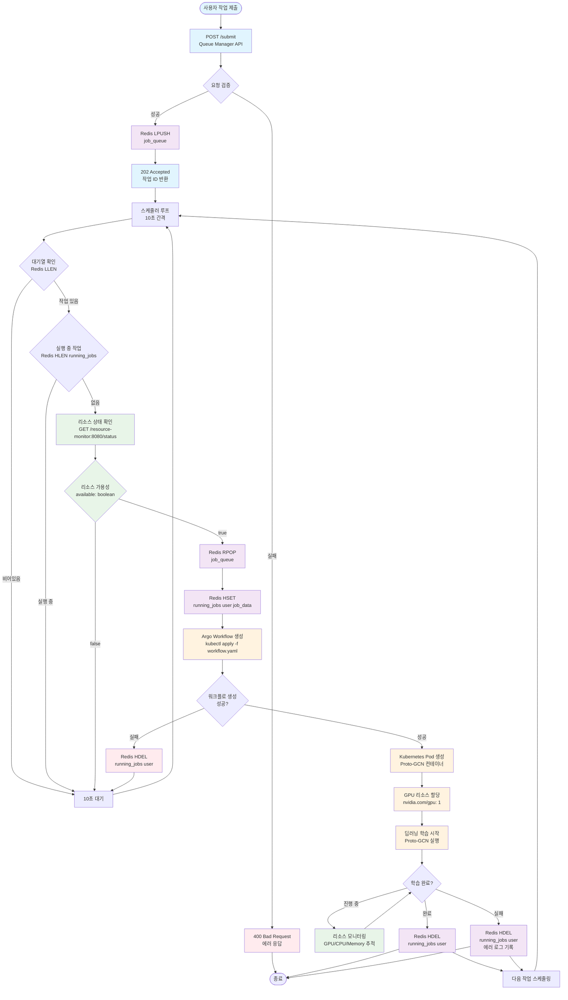
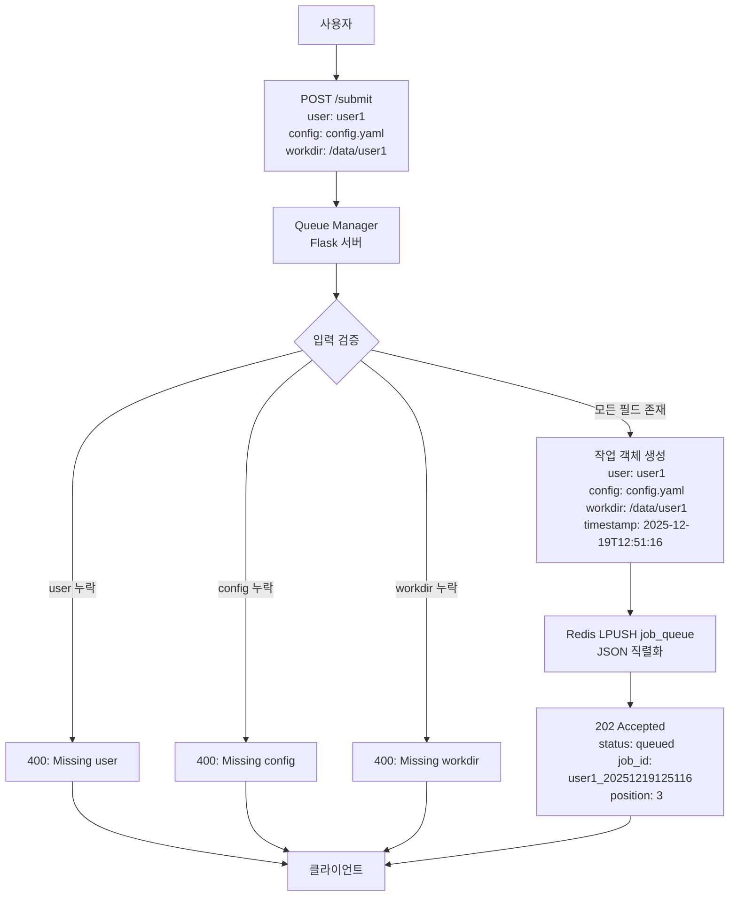
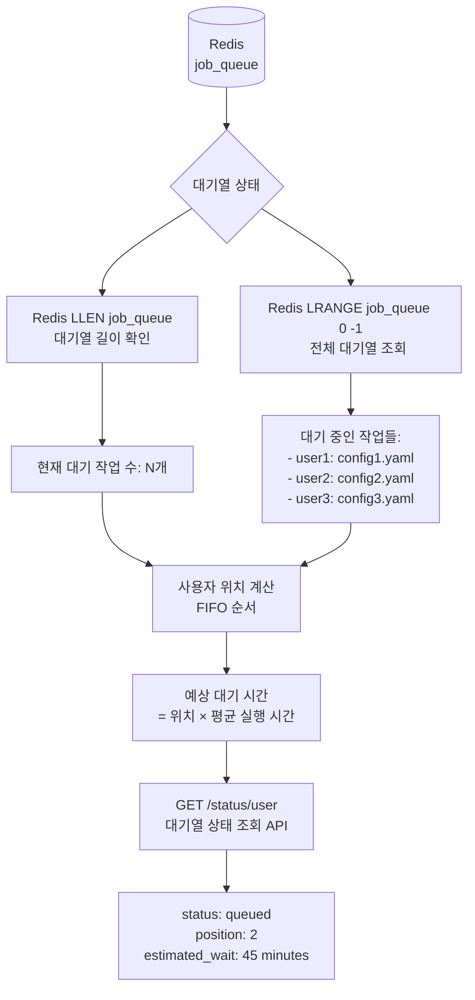
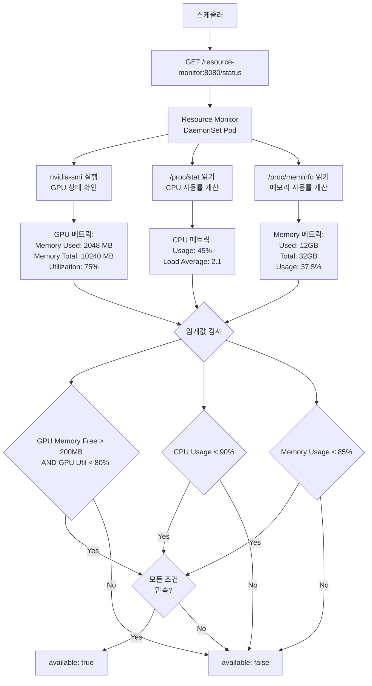
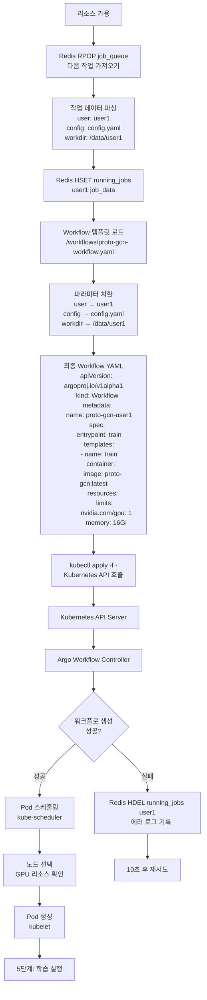
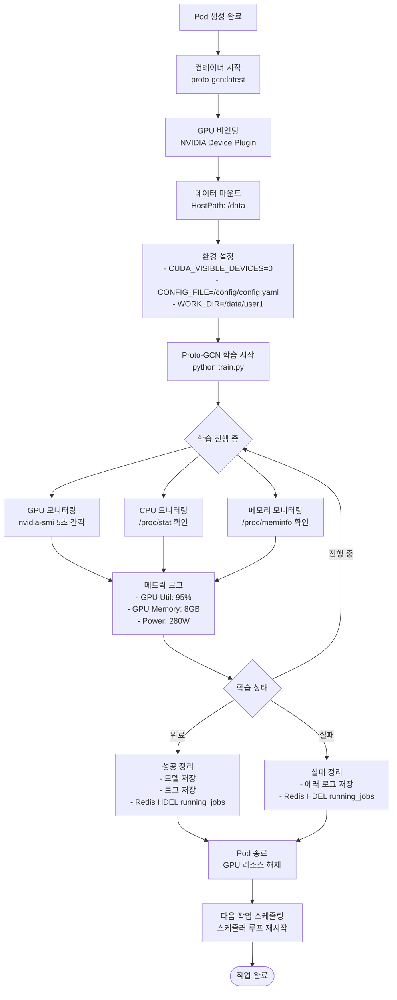
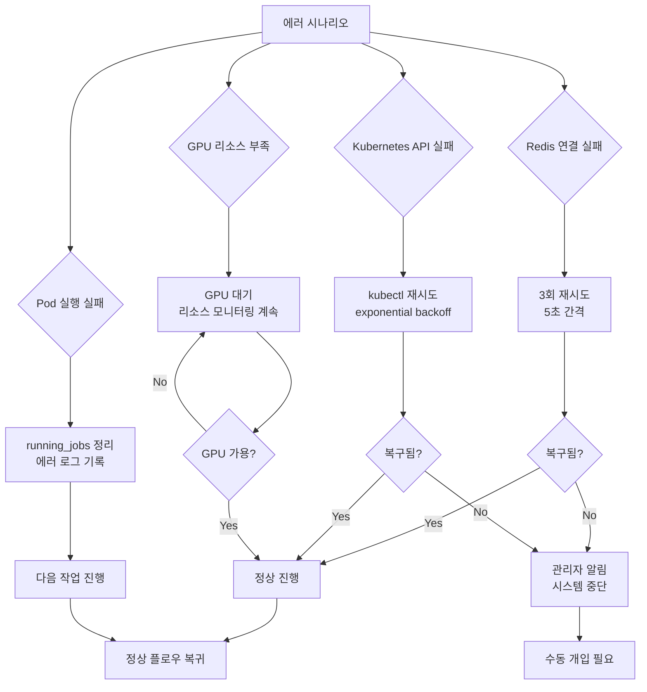

# 데이터 흐름 플로우 차트

## 전체 시스템 데이터 흐름

```mermaid
flowchart TD
    START([사용자 작업 제출]) --> SUBMIT[POST /submit<br/>Queue Manager API]
    SUBMIT --> VALIDATE{요청 검증}
    VALIDATE -->|실패| ERROR[400 Bad Request<br/>에러 응답]
    VALIDATE -->|성공| ENQUEUE[Redis LPUSH<br/>job_queue]
    
    ENQUEUE --> RESPONSE[202 Accepted<br/>작업 ID 반환]
    RESPONSE --> SCHEDULER_LOOP[스케줄러 루프<br/>10초 간격]
    
    SCHEDULER_LOOP --> CHECK_QUEUE{대기열 확인<br/>Redis LLEN}
    CHECK_QUEUE -->|비어있음| WAIT[10초 대기]
    WAIT --> SCHEDULER_LOOP
    
    CHECK_QUEUE -->|작업 있음| CHECK_RUNNING{실행 중 작업<br/>Redis HLEN running_jobs}
    CHECK_RUNNING -->|실행 중| WAIT
    
    CHECK_RUNNING -->|없음| RESOURCE_CHECK[리소스 상태 확인<br/>GET /resource-monitor:8080/status]
    RESOURCE_CHECK --> PARSE_RESOURCE{리소스 가용성<br/>available: boolean}
    
    PARSE_RESOURCE -->|false| WAIT
    PARSE_RESOURCE -->|true| DEQUEUE[Redis RPOP<br/>job_queue]
    
    DEQUEUE --> SET_RUNNING[Redis HSET<br/>running_jobs user job_data]
    SET_RUNNING --> CREATE_WORKFLOW[Argo Workflow 생성<br/>kubectl apply -f workflow.yaml]
    
    CREATE_WORKFLOW --> WORKFLOW_SUCCESS{워크플로 생성<br/>성공?}
    WORKFLOW_SUCCESS -->|실패| CLEANUP[Redis HDEL<br/>running_jobs user]
    CLEANUP --> WAIT
    
    WORKFLOW_SUCCESS -->|성공| POD_CREATION[Kubernetes Pod 생성<br/>Proto-GCN 컨테이너]
    POD_CREATION --> GPU_ALLOCATION[GPU 리소스 할당<br/>nvidia.com/gpu: 1]
    
    GPU_ALLOCATION --> TRAINING_START[딥러닝 학습 시작<br/>Proto-GCN 실행]
    TRAINING_START --> TRAINING_COMPLETE{학습 완료?}
    
    TRAINING_COMPLETE -->|진행 중| MONITOR[리소스 모니터링<br/>GPU/CPU/Memory 추적]
    MONITOR --> TRAINING_COMPLETE
    
    TRAINING_COMPLETE -->|완료| CLEANUP_SUCCESS[Redis HDEL<br/>running_jobs user]
    TRAINING_COMPLETE -->|실패| CLEANUP_FAILED[Redis HDEL<br/>running_jobs user<br/>에러 로그 기록]
    
    CLEANUP_SUCCESS --> NEXT_JOB[다음 작업 스케줄링]
    CLEANUP_FAILED --> NEXT_JOB
    NEXT_JOB --> SCHEDULER_LOOP
    
    ERROR --> END([종료])
    CLEANUP_SUCCESS --> END
    CLEANUP_FAILED --> END
    
    classDef userClass fill:#e1f5fe
    classDef queueClass fill:#f3e5f5
    classDef resourceClass fill:#e8f5e8
    classDef workflowClass fill:#fff3e0
    classDef errorClass fill:#ffebee
    
    class START,SUBMIT,RESPONSE userClass
    class ENQUEUE,DEQUEUE,SET_RUNNING,CLEANUP,CLEANUP_SUCCESS,CLEANUP_FAILED queueClass
    class RESOURCE_CHECK,PARSE_RESOURCE,MONITOR resourceClass
    class CREATE_WORKFLOW,POD_CREATION,GPU_ALLOCATION,TRAINING_START workflowClass
    class ERROR,CLEANUP errorClass
```

## 1단계: 작업 제출

```mermaid
flowchart TD
    USER[사용자] --> API_CALL["POST /submit
    user: user1
    config: config.yaml
    workdir: /data/user1"]
    
    API_CALL --> QUEUE_MGR["Queue Manager
    Flask 서버"]
    QUEUE_MGR --> VALIDATE{입력 검증}
    
    VALIDATE -->|user 누락| ERR_USER[400: Missing user]
    VALIDATE -->|config 누락| ERR_CONFIG[400: Missing config]
    VALIDATE -->|workdir 누락| ERR_WORKDIR[400: Missing workdir]
    
    VALIDATE -->|모든 필드 존재| CREATE_JOB["작업 객체 생성
    user: user1
    config: config.yaml
    workdir: /data/user1
    timestamp: 2025-12-19T12:51:16"]
    
    CREATE_JOB --> REDIS_PUSH["Redis LPUSH job_queue
    JSON 직렬화"]
    REDIS_PUSH --> SUCCESS_RESPONSE["202 Accepted
    status: queued
    job_id: user1_20251219125116
    position: 3"]
    
    ERR_USER --> CLIENT[클라이언트]
    ERR_CONFIG --> CLIENT
    ERR_WORKDIR --> CLIENT
    SUCCESS_RESPONSE --> CLIENT
```

## 2단계: 대기열 저장

```mermaid
flowchart TD
    REDIS_QUEUE[("Redis
    job_queue")] --> QUEUE_STATUS{대기열 상태}
    
    QUEUE_STATUS --> LLEN["Redis LLEN job_queue
    대기열 길이 확인"]
    QUEUE_STATUS --> LRANGE["Redis LRANGE job_queue 0 -1
    전체 대기열 조회"]
    
    LLEN --> QUEUE_LENGTH[현재 대기 작업 수: N개]
    LRANGE --> QUEUE_CONTENTS["대기 중인 작업들:
    - user1: config1.yaml
    - user2: config2.yaml
    - user3: config3.yaml"]
    
    QUEUE_LENGTH --> POSITION_CALC["사용자 위치 계산
    FIFO 순서"]
    QUEUE_CONTENTS --> POSITION_CALC
    
    POSITION_CALC --> WAIT_TIME["예상 대기 시간
    = 위치 × 평균 실행 시간"]
    
    WAIT_TIME --> STATUS_API["GET /status/user
    대기열 상태 조회 API"]
    STATUS_API --> USER_RESPONSE["status: queued
    position: 2
    estimated_wait: 45 minutes"]
```

## 3단계: 리소스 확인

```mermaid
flowchart TD
    SCHEDULER[스케줄러] --> RESOURCE_REQ[GET /resource-monitor:8080/status]
    RESOURCE_REQ --> RESOURCE_MON["Resource Monitor
    DaemonSet Pod"]
    
    RESOURCE_MON --> GPU_CHECK["nvidia-smi 실행
    GPU 상태 확인"]
    RESOURCE_MON --> CPU_CHECK["/proc/stat 읽기
    CPU 사용률 계산"]
    RESOURCE_MON --> MEM_CHECK["/proc/meminfo 읽기
    메모리 사용률 계산"]
    
    GPU_CHECK --> GPU_METRICS["GPU 메트릭:
    Memory Used: 2048 MB
    Memory Total: 10240 MB
    Utilization: 75%"]
    
    CPU_CHECK --> CPU_METRICS["CPU 메트릭:
    Usage: 45%
    Load Average: 2.1"]
    
    MEM_CHECK --> MEM_METRICS["Memory 메트릭:
    Used: 12GB
    Total: 32GB
    Usage: 37.5%"]
    
    GPU_METRICS --> THRESHOLD_CHECK{임계값 검사}
    CPU_METRICS --> THRESHOLD_CHECK
    MEM_METRICS --> THRESHOLD_CHECK
    
    THRESHOLD_CHECK --> GPU_OK{"GPU Memory Free > 200MB
    AND GPU Util < 80%"}
    THRESHOLD_CHECK --> CPU_OK{CPU Usage < 90%}
    THRESHOLD_CHECK --> MEM_OK{Memory Usage < 85%}
    
    GPU_OK -->|Yes| AND_GATE{"모든 조건
    만족?"}
    CPU_OK -->|Yes| AND_GATE
    MEM_OK -->|Yes| AND_GATE
    
    GPU_OK -->|No| NOT_AVAILABLE[available: false]
    CPU_OK -->|No| NOT_AVAILABLE
    MEM_OK -->|No| NOT_AVAILABLE
    
    AND_GATE -->|Yes| AVAILABLE[available: true]
    AND_GATE -->|No| NOT_AVAILABLE
```

## 4단계: 워크플로 생성

```mermaid
flowchart TD
    AVAILABLE_RESOURCE[리소스 가용] --> DEQUEUE_JOB["Redis RPOP job_queue
    다음 작업 가져오기"]
    
    DEQUEUE_JOB --> JOB_DATA["작업 데이터 파싱
    user: user1
    config: config.yaml
    workdir: /data/user1"]
    
    JOB_DATA --> SET_RUNNING["Redis HSET running_jobs
    user1 job_data"]
    SET_RUNNING --> TEMPLATE_LOAD["Workflow 템플릿 로드
    /workflows/proto-gcn-workflow.yaml"]
    
    TEMPLATE_LOAD --> PARAM_SUBSTITUTE["파라미터 치환
    user → user1
    config → config.yaml
    workdir → /data/user1"]
    
    PARAM_SUBSTITUTE --> WORKFLOW_YAML["최종 Workflow YAML
    apiVersion: argoproj.io/v1alpha1
    kind: Workflow
    metadata:
      name: proto-gcn-user1
    spec:
      entrypoint: train
      templates:
      - name: train
        container:
          image: proto-gcn:latest
          resources:
            limits:
              nvidia.com/gpu: 1
              memory: 16Gi"]
    
    WORKFLOW_YAML --> KUBECTL_APPLY["kubectl apply -f -
    Kubernetes API 호출"]
    
    KUBECTL_APPLY --> K8S_API[Kubernetes API Server]
    K8S_API --> ARGO_CONTROLLER[Argo Workflow Controller]
    
    ARGO_CONTROLLER --> WORKFLOW_CREATED{"워크플로 생성
    성공?"}
    
    WORKFLOW_CREATED -->|성공| POD_SCHEDULE["Pod 스케줄링
    kube-scheduler"]
    WORKFLOW_CREATED -->|실패| ERROR_CLEANUP["Redis HDEL running_jobs user1
    에러 로그 기록"]
    
    POD_SCHEDULE --> NODE_SELECTION["노드 선택
    GPU 리소스 확인"]
    NODE_SELECTION --> POD_CREATION["Pod 생성
    kubelet"]
    
    ERROR_CLEANUP --> SCHEDULER_RETRY[10초 후 재시도]
    POD_CREATION --> NEXT_STEP[5단계: 학습 실행]
```

## 5단계: 학습 실행

```mermaid
flowchart TD
    POD_CREATED[Pod 생성 완료] --> CONTAINER_START[컨테이너 시작<br/>proto-gcn:latest]
    
    CONTAINER_START --> GPU_BIND[GPU 바인딩<br/>NVIDIA Device Plugin]
    GPU_BIND --> DATA_MOUNT[데이터 마운트<br/>HostPath: /data]
    
    DATA_MOUNT --> ENV_SETUP[환경 설정<br/>- CUDA_VISIBLE_DEVICES=0<br/>- CONFIG_FILE=/config/config.yaml<br/>- WORK_DIR=/data/user1]
    
    ENV_SETUP --> PROTO_GCN_START[Proto-GCN 학습 시작<br/>python train.py]
    
    PROTO_GCN_START --> TRAINING_LOOP{학습 진행 중}
    
    TRAINING_LOOP --> GPU_MONITOR[GPU 모니터링<br/>nvidia-smi 5초 간격]
    TRAINING_LOOP --> CPU_MONITOR[CPU 모니터링<br/>/proc/stat 확인]
    TRAINING_LOOP --> MEM_MONITOR[메모리 모니터링<br/>/proc/meminfo 확인]
    
    GPU_MONITOR --> METRICS_LOG[메트릭 로그<br/>- GPU Util: 95%<br/>- GPU Memory: 8GB<br/>- Power: 280W]
    
    CPU_MONITOR --> METRICS_LOG
    MEM_MONITOR --> METRICS_LOG
    
    METRICS_LOG --> TRAINING_STATUS{학습 상태}
    
    TRAINING_STATUS -->|진행 중| TRAINING_LOOP
    TRAINING_STATUS -->|완료| SUCCESS_CLEANUP[성공 정리<br/>- 모델 저장<br/>- 로그 저장<br/>- Redis HDEL running_jobs]
    TRAINING_STATUS -->|실패| FAILURE_CLEANUP[실패 정리<br/>- 에러 로그 저장<br/>- Redis HDEL running_jobs]
    
    SUCCESS_CLEANUP --> POD_TERMINATION[Pod 종료<br/>GPU 리소스 해제]
    FAILURE_CLEANUP --> POD_TERMINATION
    
    POD_TERMINATION --> NEXT_SCHEDULE[다음 작업 스케줄링<br/>스케줄러 루프 재시작]
    
    NEXT_SCHEDULE --> COMPLETE([작업 완료])
```

## 에러 처리 및 복구

```mermaid
flowchart TD
    ERROR_SCENARIOS[에러 시나리오] --> REDIS_DOWN{Redis 연결 실패}
    ERROR_SCENARIOS --> K8S_DOWN{Kubernetes API 실패}
    ERROR_SCENARIOS --> GPU_ERROR{GPU 리소스 부족}
    ERROR_SCENARIOS --> POD_FAIL{Pod 실행 실패}
    
    REDIS_DOWN --> REDIS_RETRY[3회 재시도<br/>5초 간격]
    REDIS_RETRY --> REDIS_RECOVER{복구됨?}
    REDIS_RECOVER -->|Yes| CONTINUE[정상 진행]
    REDIS_RECOVER -->|No| ALERT[관리자 알림<br/>시스템 중단]
    
    K8S_DOWN --> K8S_RETRY[kubectl 재시도<br/>exponential backoff]
    K8S_RETRY --> K8S_RECOVER{복구됨?}
    K8S_RECOVER -->|Yes| CONTINUE
    K8S_RECOVER -->|No| ALERT
    
    GPU_ERROR --> WAIT_GPU[GPU 대기<br/>리소스 모니터링 계속]
    WAIT_GPU --> GPU_AVAILABLE{GPU 가용?}
    GPU_AVAILABLE -->|Yes| CONTINUE
    GPU_AVAILABLE -->|No| WAIT_GPU
    
    POD_FAIL --> CLEANUP_FAILED[running_jobs 정리<br/>에러 로그 기록]
    CLEANUP_FAILED --> NEXT_JOB[다음 작업 진행]
    
    CONTINUE --> NORMAL_FLOW[정상 플로우 복귀]
    ALERT --> MANUAL_INTERVENTION[수동 개입 필요]
    NEXT_JOB --> NORMAL_FLOW
```
